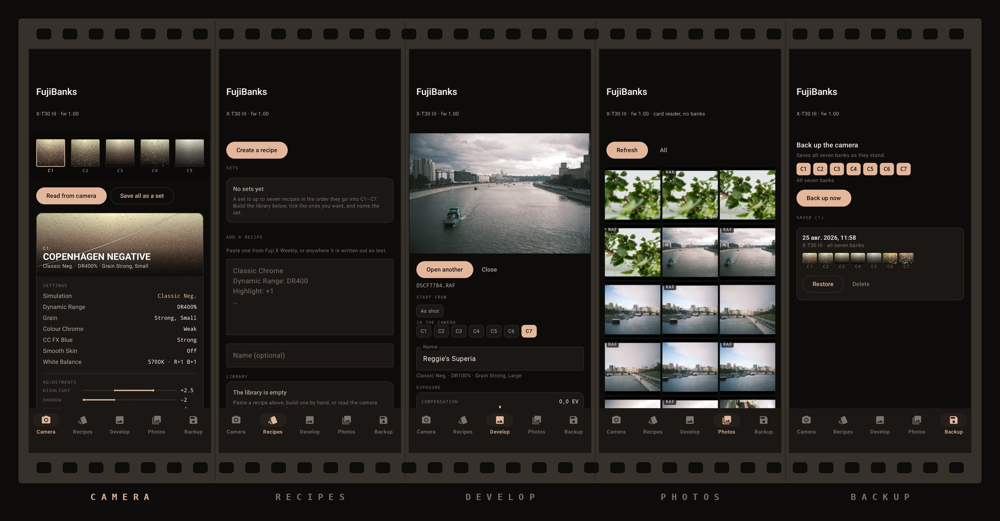

# FujiBanks

Android utility for Fujifilm recipe banks. Reads and writes C1–C7 over USB,
imports recipes pasted from [Fuji X Weekly](https://fujixweekly.com), develops
RAF files through the camera's own processor, and keeps a snapshot of what was
in the camera so a write can always be undone.

Personal tool, published because the protocol work in it is worth sharing. No
backend, no accounts, not on the Play Store.

Tested on an **X-T30 III**. It may work on any Fujifilm
camera that speaks the same property map — but read
[Before trusting a write on a new body](#before-trusting-a-write-on-a-new-body)
first, because that map is not guaranteed to be the same on yours.



<sub>Camera · Recipes · Develop · Photos · Backup.</sub>

## Install

Grab the APK from [Releases](../../releases) and install it. Requires Android 8.0
(API 26) and a phone with USB host support.

The app asks for no permissions at all. USB access is granted per-device by
Android's own dialog when you plug the camera in.

## Build

```sh
./gradlew :app:assembleDebug
./gradlew :app:testDebugUnitTest
adb install -r app/build/outputs/apk/debug/FujiBanks-v1.0.0-debug.apk
```

A release build additionally needs a signing key — see
`keystore.properties.example`. Without one, `assembleRelease` still runs and
produces an unsigned APK.

<details>
<summary>Building on the author's machine (<code>env.sh</code>)</summary>

Nothing is installed system-wide on that box — no `java`, no Gradle, no Android
SDK outside one toolchain directory, so `env.sh` points at it:

```sh
cp env.sh.example env.sh     # then edit the paths in it
source env.sh
```

`env.sh` itself is gitignored, since those paths belong to one machine. None of
this is needed to build the project — `JAVA_HOME=/your/jdk ./gradlew` does the
same job.

It also unsets the shell's proxy variables. `sdkmanager` fails with "IO
exception while downloading manifest" when `HTTP_PROXY` is set, because the JVM
ignores it for its own connection handling — Google's hosts are reachable
directly there anyway.
</details>

## Using it

The camera has two USB modes and they are mutually exclusive:

- `USB RAW CONV./BACKUP RESTORE` — banks, backup and develop. The card is not
  exposed here at all.
- `USB CARD READER` — the Photos screen. Bank properties are unavailable here.

Both live under `MENU → CONNECTION SETTING → CONNECTION MODE`. Pick the one you
need, connect the camera USB-C to USB-C, grant USB access when asked, then read.

Both modes also **lock the camera's controls** while it is plugged in, so
changing a setting on the camera means unplugging. The app expects that: hotplug
is watched and the session comes back on its own.

Despite the name, card-reader mode is still PTP rather than USB Mass Storage —
which is what makes it readable from Android at all, since Android has no
host-side mass storage support.

## Your camera, and your risk

Worth reading before the first time you plug in, because this is the part that
touches hardware you paid for.

**What it writes.** With the camera in `USB RAW CONV./BACKUP RESTORE`, installing
a recipe writes the custom settings banks C1–C7 over the cable. It sets each
property on its own rather than replacing a settings file, and it touches
nothing outside the bank you pointed it at.

**What it does before writing.** Every write is preceded by a full snapshot of
all seven banks, and nothing is sent if that read fails. You are shown a diff,
slot by slot, before anything goes out. Afterwards every property is read back
and compared byte for byte, and mismatches are reported individually. Undo puts
the snapshot back. None of this makes a write safe — it makes a bad write
visible and reversible, which is not the same thing.

**What it does not touch.** Your photographs and your card. In bank mode the
camera does not expose the card at all; storage enumeration returns two empty
conversion buffers. In `USB CARD READER` this app only reads. RAW conversion
uploads the RAF into the camera's own conversion buffer and deletes exactly one
object — the JPEG that conversion just produced.

**The real risk is the property map.** This app has been tested on an X-T30 III
and on nothing else. The map itself came from FilmKit, measured on a different
body, and the two already disagree in two places — so the map is known to vary
between bodies, and nobody has checked yours. On anything else a write can land
in a property this app has mislabelled, and the read-back will happily confirm
that the wrong setting was written correctly. Run **Dump** first and check, as
described below. This is not a formality.

**Do not unplug or power the camera off while a write is running.** Take your own
backup of any bank you cannot afford to lose, and check your settings before a
shoot that matters.

**Warranty.** Fujifilm licenses its camera SDK selectively, and this project is
not licensed by them. Connecting third-party software to your camera may affect
what a manufacturer will cover if something later goes wrong, and how that plays
out depends on where you live and on Fujifilm's discretion. Nobody here can tell
you how it would go for you. If your warranty matters more to you than this app
does, do not connect the camera.

**Not affiliated with Fujifilm.** Not made by, endorsed by, licensed by or
connected to FUJIFILM Corporation. It speaks the same standard PTP interface the
camera already exposes to Fujifilm's own desktop software, and nothing more.

**As is, and entirely at your own risk.** This is a personal tool, published
because the protocol work in it is worth sharing. It is not a product. It comes
with no warranty of any kind, no support, and no promise that it is fit for any
purpose — see [LICENSE](LICENSE).

You connect your camera and use this software by your own choice, and everything
that follows is on you. The author accepts no liability for anything arising from
its use: altered, lost or corrupted camera settings; damage to the camera, the
lens, the card or the phone; data lost from any of them; the cost of repairing or
replacing anything; a warranty claim refused because you connected; a body left
in a state its manufacturer never documented; or the photographs you did not get.
That applies however the harm comes about, including where it is caused by a
defect in this software or by a mistake in the property map, and whether or not
anyone could have foreseen it.

If it does not do what you want, stop using it. That is the whole remedy.

## Before trusting a write on a new body

The property map came from FilmKit, reverse-engineered on a different Fujifilm
body. It has been checked here against an **X-T30 III** and nothing else, and two
encodings already differ between the two — `D195` (Grain) and `D18F`. The map
varies between bodies, so treat it as probable rather than certain on yours.

Run **Dump** first (long-press the title bar). It prints, per slot, every
property `D18E`–`D1A5` with its raw bytes and — where the camera reports one —
its type, writability and allowed range. Then:

1. Dump, and save the output.
2. Change exactly one parameter in C1 from the camera's own menu (Sharpness is
   easy to see).
3. Dump again and diff.

If the changed value lands in the property this app calls `Sharpness x10`, with
the expected `×10` encoding, the map holds. If it lands somewhere else, fix
`fuji/FujiProps.kt` — nothing else needs to change.

Every write is preceded by a full backup and followed by a read-back comparison,
so a wrong map should surface as a reported mismatch rather than as silent
damage. That is a safety net, not a licence to skip the dump.

## How it works

Banks are reachable with plain PTP; no vendor opcodes are involved.

| Property | Meaning |
|---|---|
| `D18C` | slot selector — write 1–7, then reads and writes target that bank |
| `D18D` | preset name (PTP string) |
| `D18E`–`D1A5` | the 24 recipe properties |

The encodings are not uniform, and the awkward ones are why `fuji/Codec.kt`
exists and is the most heavily tested file here:

- Tone parameters are stored ×10, so `+1.5` is `15`.
- High ISO NR is a lookup table with no arithmetic relation to its value, and it
  is not monotonic: `-2 → 0x4000` while `+2 → 0x0000`.
- Effects are 1-indexed (`1=Off, 2=Weak, 3=Strong`), grain is a flat enum 1–5,
  dynamic range is a raw percentage.
- White balance reads back signed and has to be masked to `0xFFFF`.

Some properties are conditional, and a write the camera rejects cannot be told
apart from a real failure — so they are never attempted:

- `Color` on a monochrome simulation, `MonoWC`/`MonoMG` on a colour one.
- `ColorTemp` unless the WB mode is already Color Temperature.
- A zero write to `MonoWC`/`MonoMG`, which the camera refuses.

Write order matters for the same reason: the film simulation goes in before the
parameters it gates, and the WB mode before the colour temperature.

RAW conversion pushes the RAF into the camera's fixed-RAM conversion buffer
(`SendObjectInfo` with format code `0xF802`, filename `FUP_FILE.dat`), patches
the profile the frame was shot with (`D185`) rather than building one from
scratch, and starts the conversion with `D183`. Fields left alone keep their
sentinel and the camera falls back to the RAF's own EXIF; building a profile
from scratch produces a visible shift away from the in-camera rendering.

## Layout

```
usb/     Ptp.kt, PtpData.kt, UsbTransport.kt   PTP containers, datasets, bulk transfers
fuji/    FujiProps.kt, Enums.kt, Codec.kt      property map and encodings
         Recipe.kt, Darkroom.kt, FujiCamera.kt domain model, RAW profile, camera session
recipe/  TextRecipeParser.kt                   Fuji X Weekly text import
data/    Stores.kt                             snapshots and packs, as JSON files
ui/                                            Compose: Camera, Recipes, Develop, Photos, Backup, Debug
```

## State

Run against the camera and working on the X-T30 III: USB transport, session and
hotplug recovery, reading banks C1–C7, installing recipes into banks with the
read-back diff, developing a RAF through the camera's processor, listing and
copying frames off the card, and the property dump and sweep tools.

## Credit

Property map, encoding tables and the shape of the text parser come from
[FilmKit](https://github.com/eggricesoy/filmkit) (MIT), which reverse-engineered
them from Wireshark captures of X RAW Studio.

## License

MIT — see [LICENSE](LICENSE), which includes the warranty disclaimer in its
usual form. Third-party notices are in [THIRD_PARTY.md](THIRD_PARTY.md).

What that means in practice for a piece of software that writes to a camera is
spelled out in plain language under
[Your camera, and your risk](#your-camera-and-your-risk).
